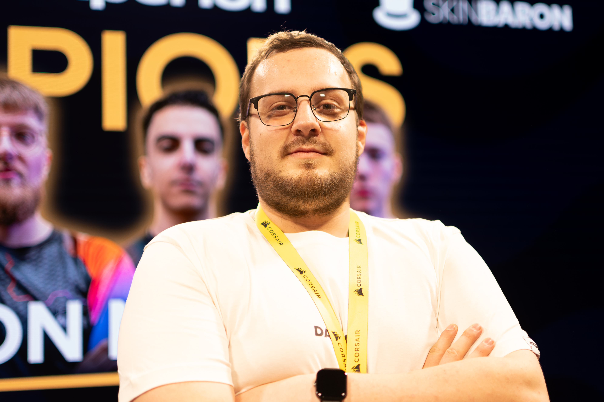

# B E N J A M I N

### Full Stack Developer · Cybersecurity Analyst · Cloud Infrastructure Engineer

25, from Hannover, Germany. E-Sports Player and Enthusiast working in E-Sports. 
building the future of e-sports management at <a href="https://competesync.gg"><strong>CompeteSync</strong></a>

 

 

---

 

### S T A C K

**React** &nbsp;·&nbsp; **Next.js** &nbsp;·&nbsp; **TypeScript** &nbsp;·&nbsp; **Tailwind**
 
**Laravel** &nbsp;·&nbsp; **Supabase** &nbsp;·&nbsp; **Docker**

 

 

---

 

V E R I F I E D &nbsp; S K I L L S

 

| Certification                                                                                                             | Authority |
| :------------------------------------------------------------------------------------------------------------------------ | :-------- |
| [**Certified Ethical Hacker**](https://www.credly.com/badges/6c2ca9cd-b171-4792-9ef0-6d71d0698769/public_url)             | Cisco     |
| [**IT Essentials**](https://www.credly.com/badges/9419dcb0-2258-4bc2-abba-c3492ceebf3b/public_url)                        | Cisco     |
| [**Network Addressing & Troubleshooting**](https://www.credly.com/badges/104c3b3f-31e4-4ed0-9672-bfbff810df02/public_url) | Cisco     |
| [**Introduction to Data Science**](https://www.credly.com/badges/4b1ed593-b80e-4143-8ac7-11339b536e87/public_url)         | Cisco     |
| [**GitHub Foundations**](https://www.credly.com/badges/536cbfb4-38c0-41e9-a8d7-68c3c9a5238c/public_url)                   | GitHub    |
| [**3CX Basic Certified v20 Engineer**](https://portal.3cx.com/share/certificate/JHJIMPxKo1)                               | 3CX       |
| [**3CX Advanced Certified v20 Engineer**](https://portal.3cx.com/share/certificate/ttdQYhNkDT)                            | 3CX       |

 
 

